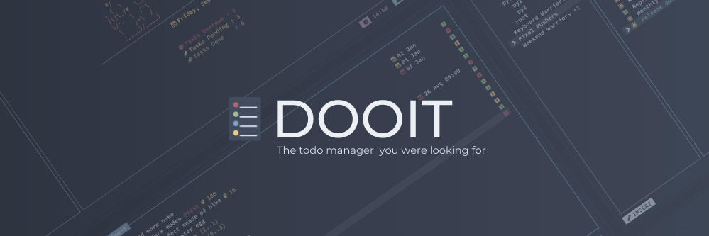
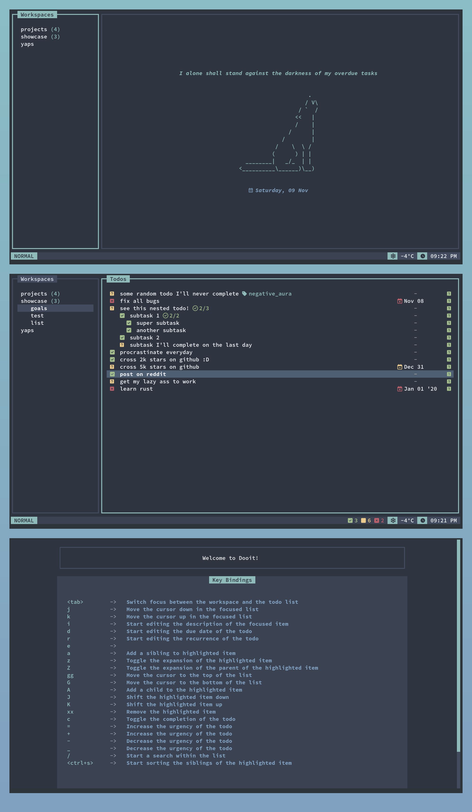
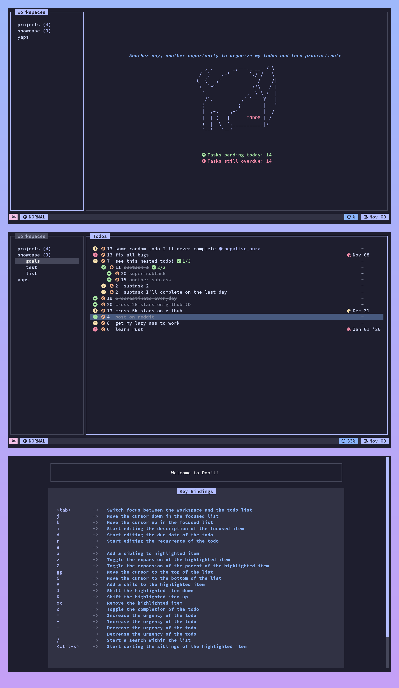
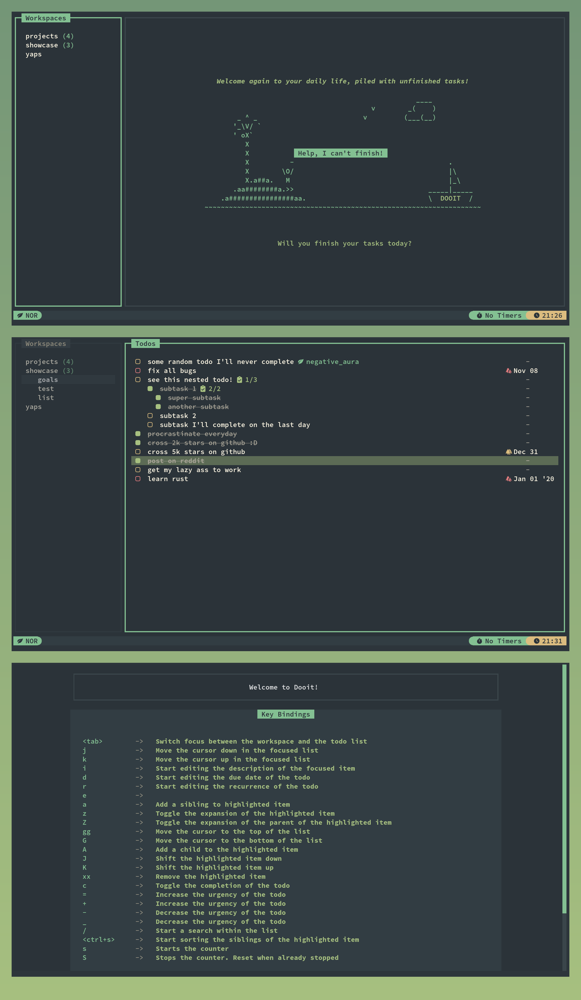

# Dooit ✔️
*A todo manager that you didn't ask for, but needed !*

-----------------------------

For installation and configuration, check out [the wiki](https://dooit-org.github.io/dooit/)

# Features 🌟

- An interactive & beautiful UI
- Fully customizable, you can configure your bar, your colors and how everything is displayed!
- Extensible, python config file allows you to do as much as you like!
- Vim like keybindings
- Topicwise separated Todo Lists (With branching)

**Note: See [CHANGELOG.md](CHANGELOG.md) to get more details on changes and feature additions!**

# Usage and configuration :gear:
After launching the app, You can press the `?` key to know the keybindings!

# Screenshots 🖼️

> [!NOTE]
> The configurations below heavily use [Dooit Extras](https://github.com/dooit-org/dooit-extras)

Some screenshots of app with different customized configuration <3

  
An icy configuration based on NordTheme ❄️ 

  

  
A colorful configuration based on Catpuccin 🐱 

  

  
  
A calm configuration based on Everforest 🌲 

  

# Contribution 🤝
- Want to contribute? Feel free to open a PR! 😸
- Got some ideas for improvements? I'm all ears! 👂
- If you have an idea that related to customizability, open an issue at [Dooit Extras](https://github.com/dooit-org/dooit-extras/issues/new) instead

----------------------------

#### Other TUI projects 🤓 :
If you liked dooit then you might wanna try out some of my other TUI projects as well
- [smassh](https://github.com/kraanzu/smassh) - A typing-test app for terminal
