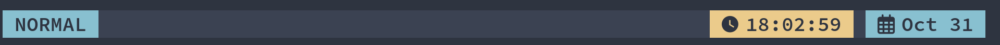

# Dooit Bar

You can customize your dooit bar using widgets!

:::tip
Check out [dooit-extras' widgets](https://dooit-org.github.io/dooit-extras/widgets/current_workspace.html)
:::

## Using widgets

Dooit's api provides `bar` attribute to set bar widgets

### Usage:

```python
from dooit_extras.bar_widgets import Mode, Spacer, Clock, Date
from dooit.ui.events import subscribe, Startup
from dooit.ui.api import DooitAPI
from dooit.ui.api.events import subscribe


@subscribe(Startup)
def setup(api: DooitAPI, _):
    theme = api.vars.theme
    api.bar.set( 
        [
            Mode(api),
            Spacer(api, width = 0),
            Clock(api, fmt=" 󰥔 {} ", bg=theme.yellow),
            Spacer(api, width = 1),
            Date(api, fmt = " {} ")
        ]
    )
```

This will render a bar like this: 


