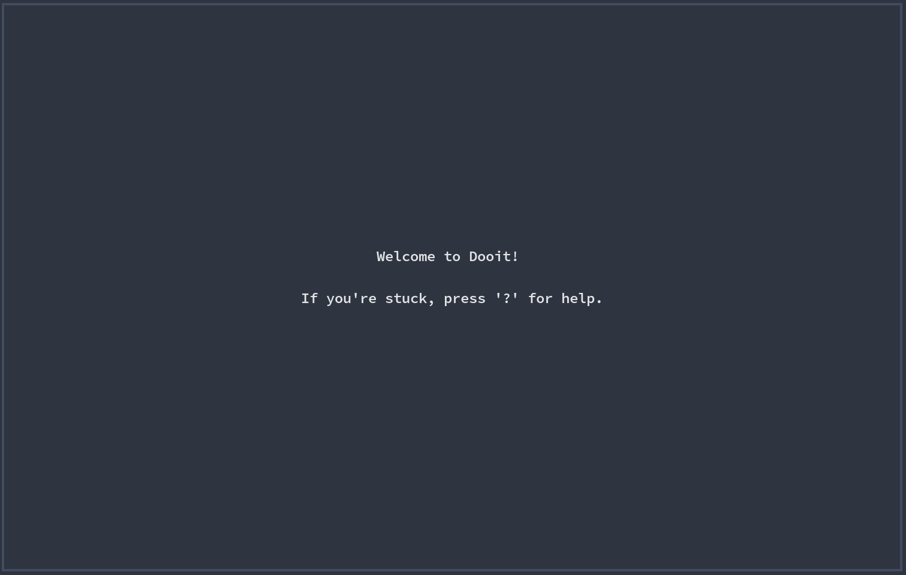
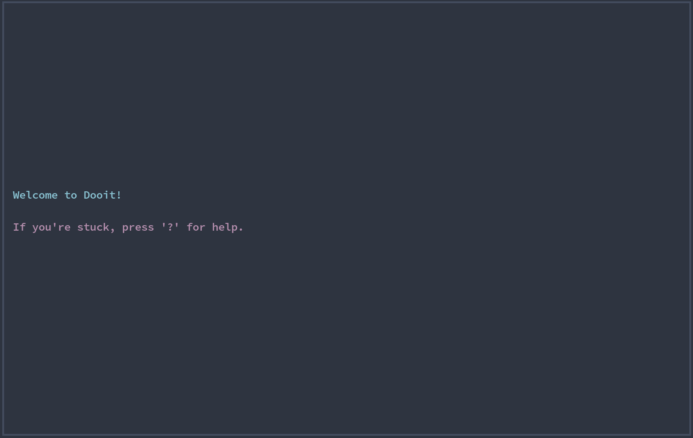

# Dooit Dashboard

Dooit's dashboard is what you see when you enter the app \
You can customize it to show ascii arts or some info in general

## Usage

You can use api's `dashboard` attribute to set it

```py
from dooit.ui.api import DooitAPI, subscribe
from dooit.ui.api.events import Startup

@subscribe(Startup)
def dashboard_setup(api: DooitAPI, _):
    api.dashboard.set(
        [
            "Welcome to Dooit!",
            "",
            "If you're stuck, press '?' for help.",
        ]
    )
```

The above setup will render something like this:



By default, everything is `center` justified and `white` but if you want to change it you can use rich's `Text` instead of plain string

For example:


```py
from dooit.ui.api import DooitAPI, subscribe
from dooit.ui.api.events import Startup
from rich.text import Text


@subscribe(Startup)
def dashboard_setup(api: DooitAPI, _):
    theme = api.vars.theme
    api.dashboard.set(
        [
            Text(
                " Welcome to Dooit!",
                style=theme.primary,
                justify="left",
            ),
            "",
            Text(
                " If you're stuck, press '?' for help.",
                style=theme.magenta,
                justify="left",
            ),
        ]
    )
```

The above setup will render something like this:



:::tip :bulb: TIP
Check out [dooit-extras's configs section](https://dooit-org.github.io/dooit-extras/configs/nord.html) to find some cool dashboards
:::
